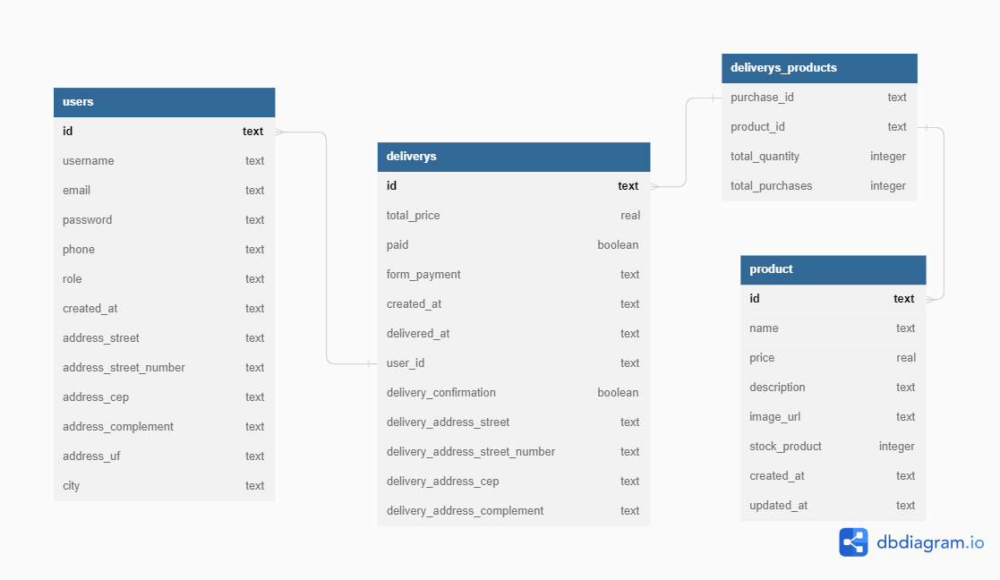

# EnaFood

## 📖 Introdução

Esta é uma aplicação BackEnd para um sistema de delivery, EnaFood, onde o usuário poderá cadastrar sua conta e realizar pedidos de produtos cadastrados e manipula-los (inserir, aumentar/diminuir quantidade, remover, etc...).

## 👥Equipe
- DANIEL EMIDIO

## 🧭Status do Projeto
- ⏳Concluido

### 📄Concepção do Projeto
Documentação Postman: [clique aqui](https://documenter.getpostman.com/view/24460616/2s93JtRPTi)

Para este projeto, são modelados 4 entidades: USERS(usuários), PRODUCTS(produtos), DELIVERYS(Pedidos), DELIVERYS_PRODUCTS(Relação Produto x Delivery).

users: username, email, password, role, phone, created_at, address_street, address_street_number, address_cep, address_complement, address_uf, city;

products: name, price, description, image_url, stock_product, created_at, updated_at

deliverys: user_id, total_price, paid, form_payment, created_at, delivery_confirmation, delivery_address_street, delivery_address_street_number, delivery_address_cep,  delivery_address_complement;

deliverys_products: product_id, delivery_id, total_quantity, total_purchase 

### Endpoints
--Users
-Post Signup: Cadastro de novos clientes 
-Get AllUsers: Retorna todos os clientes
-Get User By Id: Retorna cliente pelo ID

--Product
`-Get Product: Retorna todos os produtos
-Get Product by Id: Retorna produto pela id
-Post Product:  Cadastro de novos produtos
-Put Product: Atualização de produtos cadastrados
-Delete product: Excluir produto cadastrado`

--Delivery
- Get Deliverys: Retorna todos os pedidos cadastrados
- Get Delivery by Id: Retorna pedido pela Id
- Post Delivery: Cadastra novo pedido
- Post Add Product: Adiciona produto ao pedido
- Put Delivery: Atualiza itens do pedido
- Put Finish Delivery: Finaliza pedido
- Delete Prod Delivery: Excluir produto do pedido
- Delete Delivery: Exclui pedido

--Phase
-Get Phase: Analisa fase atual do projeto;

### Sobre o Projeto

Para análise da fase do projeto, foi elaborado o endpoint `Get Phase`, que retorna o status atual do projeto, considerando o seguinte cenário:

- Fase 1 - MVP: Nesta fase o EnaFood possui apenas poucos usuários (por volta de 100) e cada usuário pede, em média, 5 vezes por mês. Cada pedido possui de 1 a 5 produtos.
- Fase 2 – early adopters: Nesta fase o EnaFood possui mais usuários (por volta de 10.000) e cada usuário compra, em média, 10 vezes ao mês. Cada compra possui de 1 a 15 produtos.
Fase 3 – early majority: Nesta fase o EnaFood possui ainda mais usuários (por volta de
1.000.000) e cada usuário compra, em média, 25 vezes ao mês. Cada compra possui de 1 a 20
produtos.
- Fase 4 – late majority: Nesta fase o EnaFood é um sucesso e é a principal rede de delivery brasil (por volta de 50.000.000 de usuários) e cada usuário publica, em média, 30 vezes ao mês. Cada compra possui de 1 a 20 produtos.

### Bibliotecas utilizadas
- cors: biblioteca para liberar acesso externo ao servido;
- express : framework para criar o servidor (API);
- mongoose: para conexão do MongoDB;
- dotenv: biblioteca de variáveis de ambiente;

## 🛰Executando o Projeto
- npm install: Instala todas as dependências listadas no package.json;
- npm run dev: Estabelece a conexão com o banco de dados e reinicia automaticamente o servidor localhost (padrao 3003) toda a vez que o projeto for alterado e salvo.
--Observação: Para facilitar o uso e experiência do usuário a aplicação, as informações de usuário e senha da base MongoDB não foi aplicada no arquivo .env, uma vez que não se trata de um projeto real.

## 💡Programas utilizados:
- Postman API Platform
- VSCode

## 💻Tecnologias 

## 📫 Contato

E-mail: emidio.daniel@hotmail.com

